# ✅ TasksApp - Challenge ForIT 2025

Aplicación de lista de tareas desarrollada como parte del challenge técnico de ingreso a la Academia ForIT 2025.

## 🧩 Tecnologías utilizadas

- **Frontend**: Next.js 15 + CSS
- **Backend**: API Routes de Next.js
- **Base de datos**: SQLite
- **ORM**: Prisma
- **Autenticación**: JSON Web Tokens (JWT)
- **Estilos**: CSS
- **Icons**: react-icons


---

## 🚀 ¿Qué se puede hacer?

La app permite a cada usuario gestionar sus propias tareas personales. Entre las funcionalidades básicas se incluyen:

- Registrar usuarios, con formularios con validaciones
- Iniciar sesión y ver solo tus propias tareas (autenticación con JWT) 
- Crear nuevas tareas
- Editar tareas existentes
- Eliminar tareas
- Marcar tareas como completadas o no completadas
- Buscar tareas por su título
- Ver tareas filtradas por estado
- Cerrar sesión

---

## 🆚 Mejoras respecto a la versión básica del challenge

Además de cumplir con todos los requisitos mínimos, esta versión incluye:

- 🔍 **Barra de búsqueda** para filtrar tareas por título
- 🟢 **Filtro por estado**: ver solo tareas completadas, pendientes o todas
- 🔐 **Rutas protegidas en el backend** usando tokens JWT y verificación de identidad por usuario
- 🛠️ **Base de datos persistente** utilizando SQLite + Prisma ORM

Estas funcionalidades agregan una capa de realismo y escalabilidad, permitiendo extender la app fácilmente a producción con cualquier otro motor de base de datos.

---

## ⚙️ Cómo correr el proyecto localmente

1. Cloná este repositorio:

```bash
git clone https://github.com/Sil-Palaoro/TasksApp-Challenge-forIT.git
cd TasksApp-Challenge-ForIT/tasksapp-forit
```


2. Instalá las dependencias:

```bash
npm install
```


3. Configurá las variables de entorno en un archivo .env:

```bash
DATABASE_URL="file:./dev.db"
JWT_SECRET=clave-secreta
```


4. Generá el cliente Prisma y la base de datos:
```bash
npx prisma migrate dev --name init
```


Iniciá el servidor de desarrollo:
```bash
npm run dev
```


Accedé a la app en: http://localhost:3000


📂 Estructura del proyecto

```bash
/app
  /api
    /register          → Registro de usuarios
    /login             → Inicio de sesión con JWT
    /tasks             → Endpoints CRUD de tareas
      /[id]            → PUT, DELETE por ID
      /[id]/task_completed → POST para marcar completada
  /tareas              → Página principal de tareas (protegida)
  /iniciar_sesion      → Pagina login
  /cerrar_sesion       → Pagina con logica de cierre de sesión
  /registro            → Pagina de registro
  /components          → Componentes de la app


/lib
  prisma.js            → Cliente de Prisma
  jwt.js               → Funciones JWT

/prisma
  schema.prisma        → Modelos de User y Task

```

📌 Consideraciones finales

Este proyecto fue desarrollado íntegramente en Next.js 15, utilizando las nuevas App Routes (app/api) para gestionar el backend. Se utilizó Prisma como ORM y SQLite como base de datos ligera y local, ideal para pruebas o prototipos.

Todo el flujo de autenticación, manejo de tareas y rutas protegidas fue implementado manualmente para demostrar conocimientos de backend, relaciones en base de datos y uso de JWT.


---

## 📸 Capturas de pantalla

### 🏠 Home

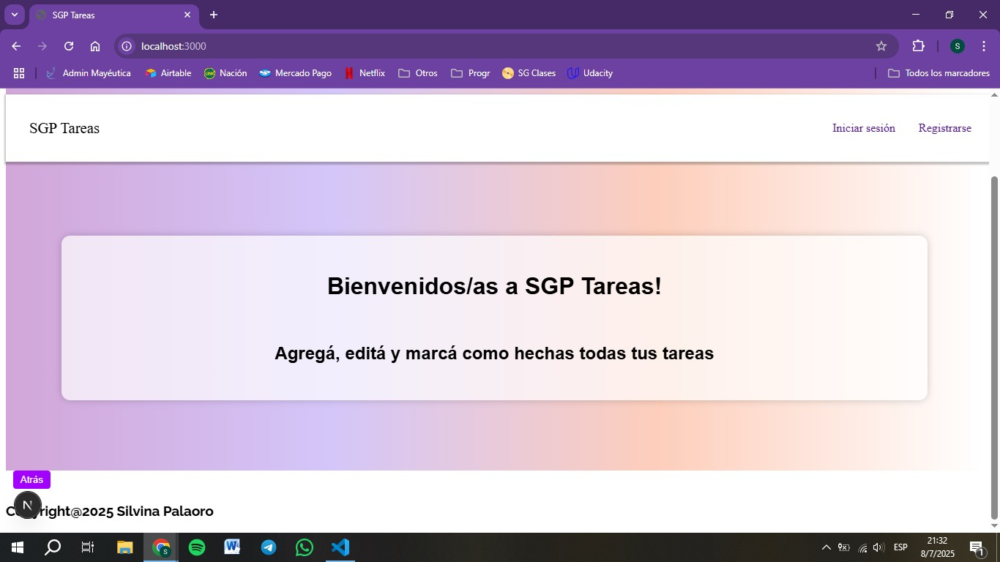

---

### 🔐 Registro e inicio de sesión

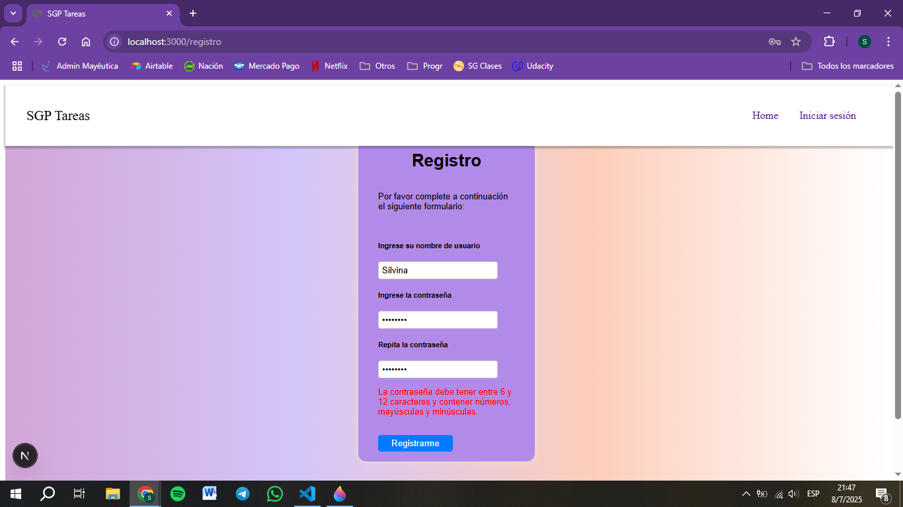

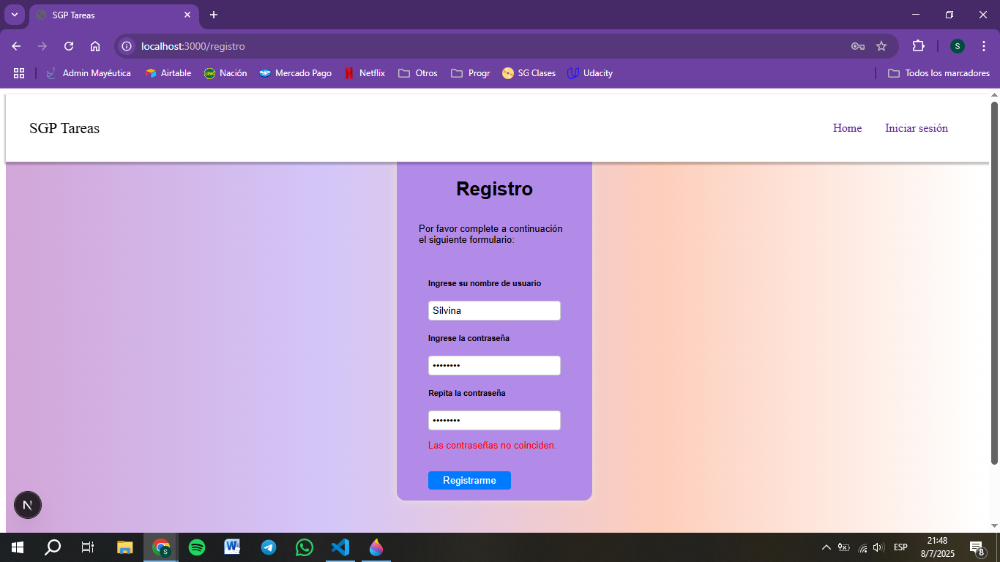

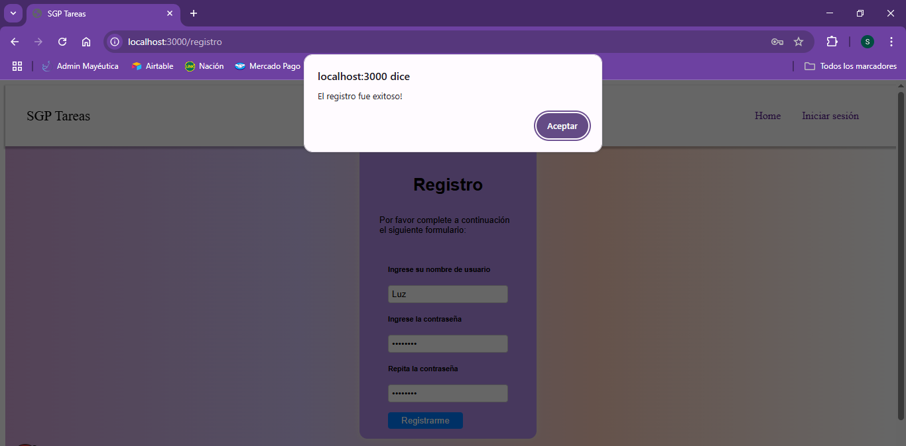


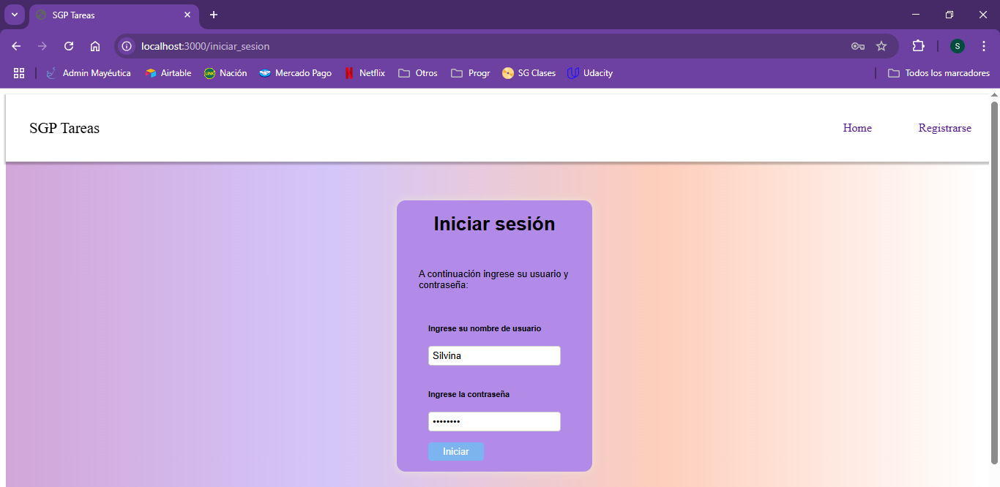


---

### 🗑️ Nueva tarea

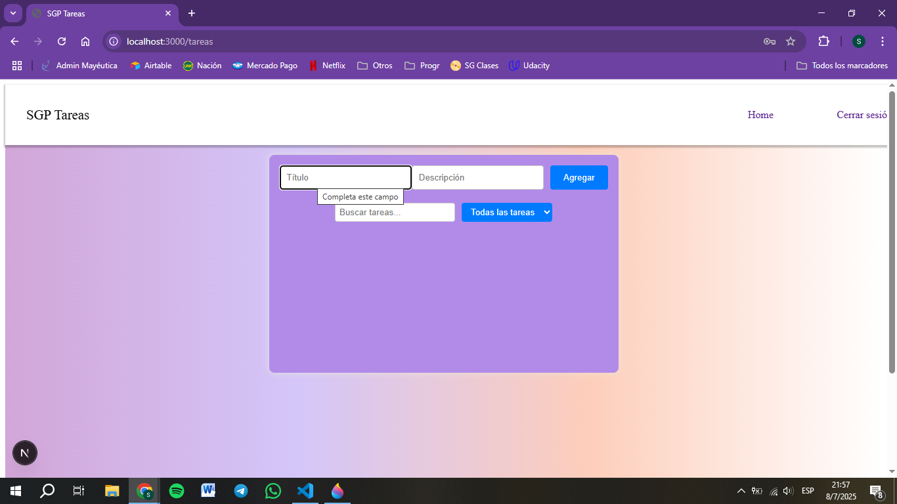

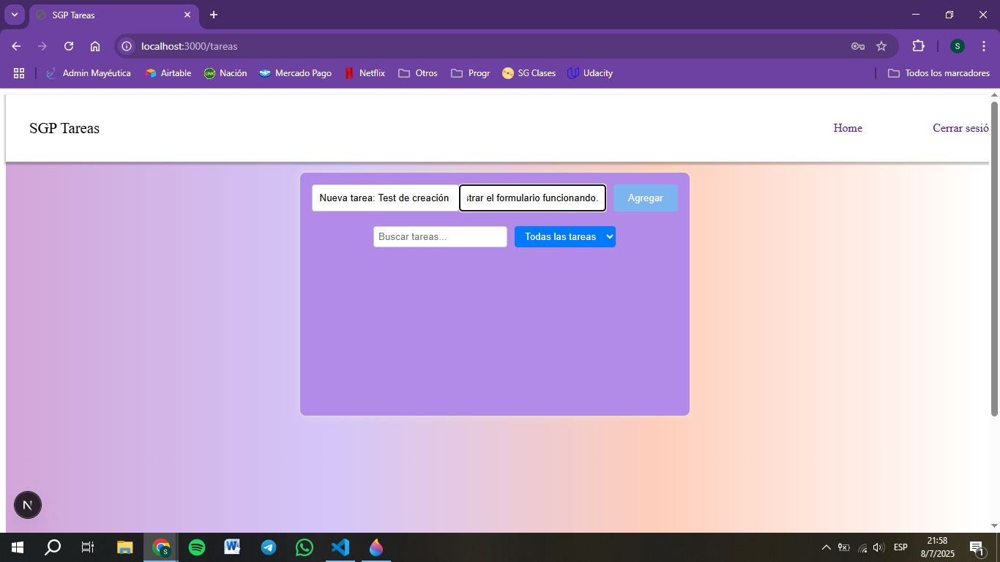

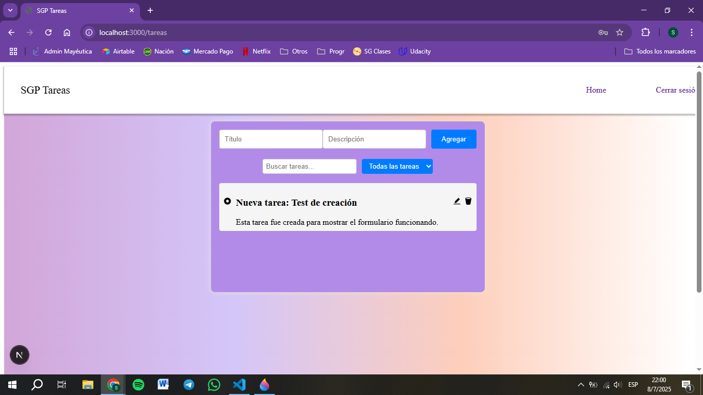


---

### 📋 Vista de tareas


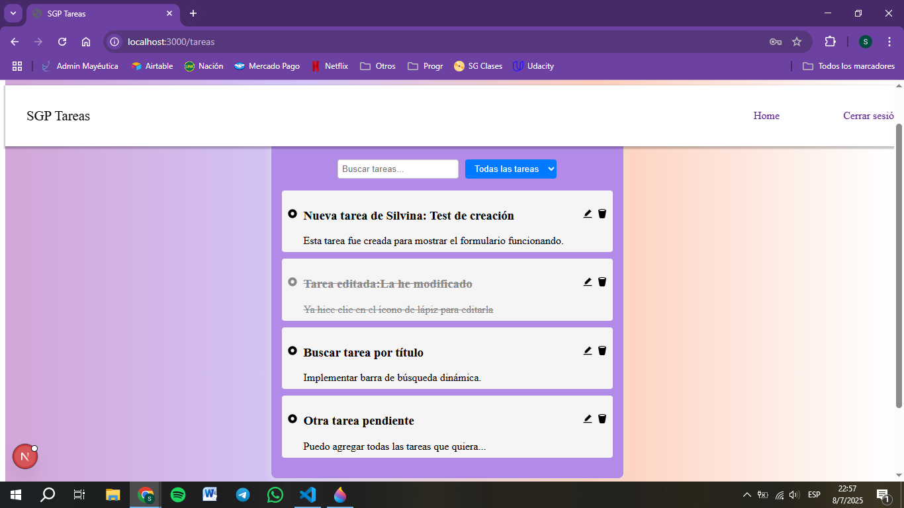

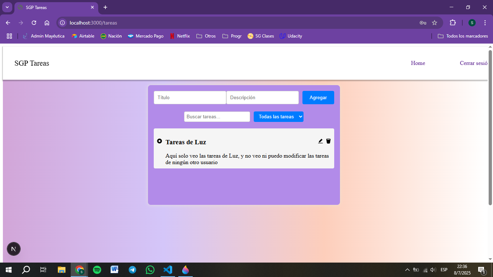

---

### 📝 Tareas editables

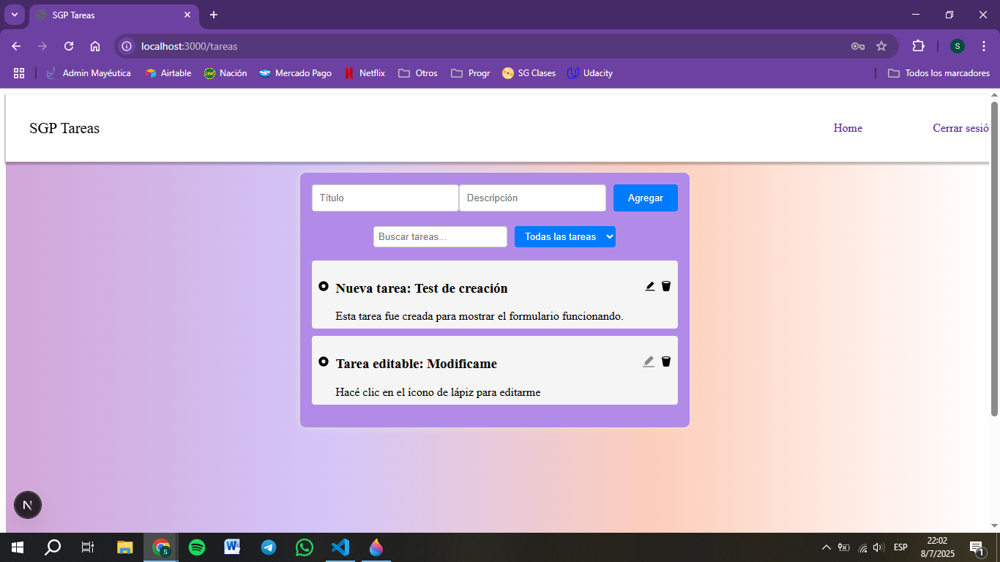

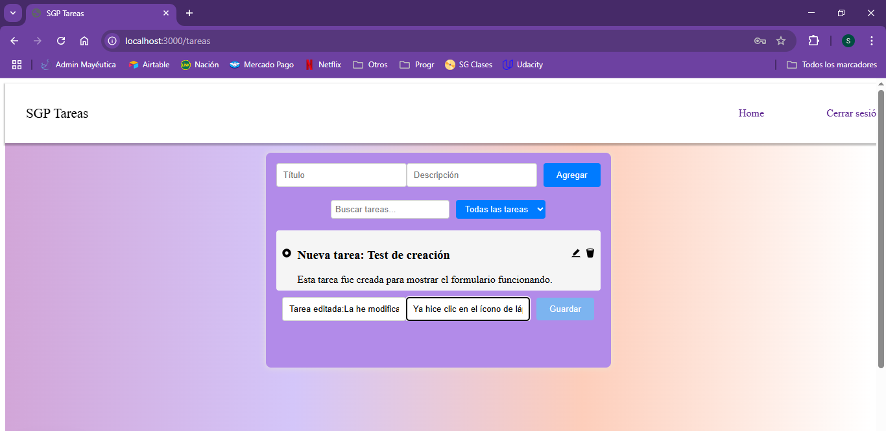

---

### 🗑️ Eliminación de tareas

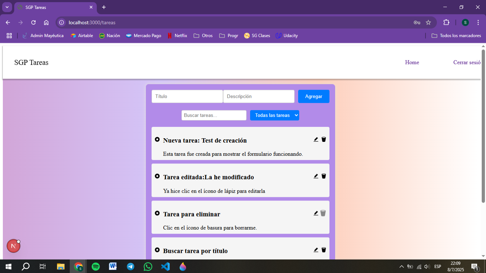


---

### ✅ Marcar tareas como completadas

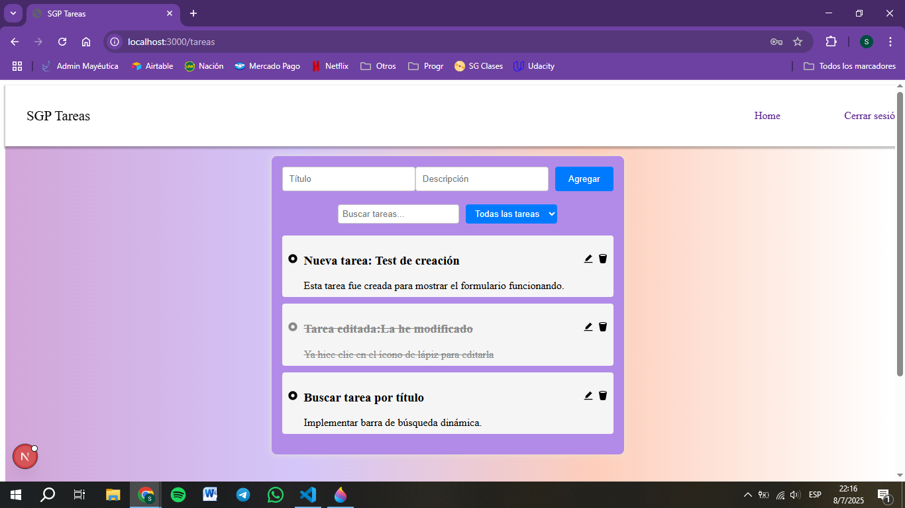


---

### 🔍 Funciones de búsqueda y filtros

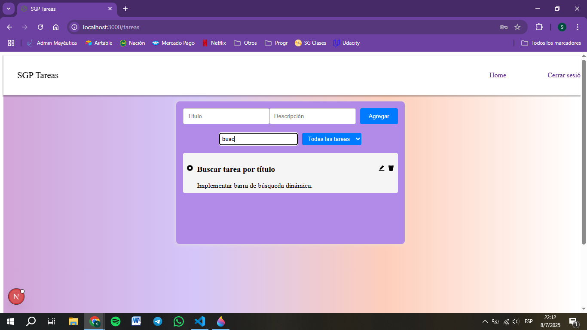

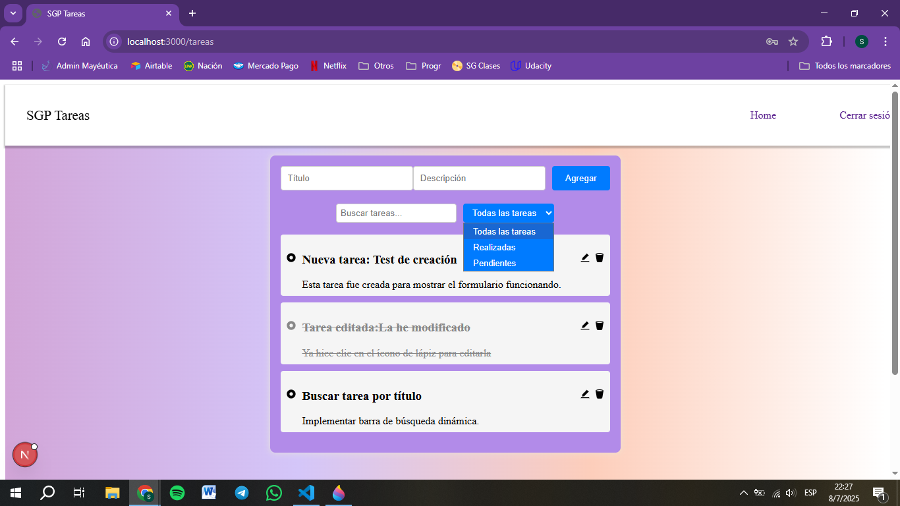

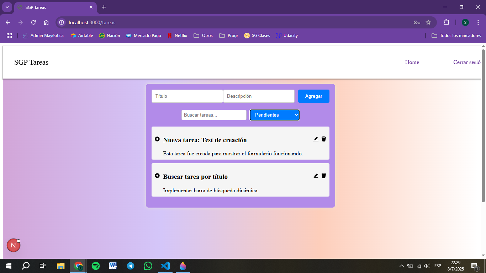

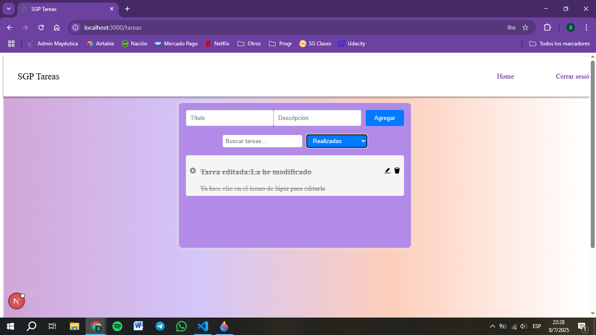


---


📫 Si querés hacerme llegar feedback, estoy en LinkedIn o por GitHub 😄

https://github.com/Sil-Palaoro

https://www.linkedin.com/in/silvina-palaoro